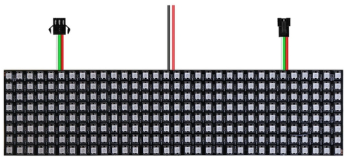
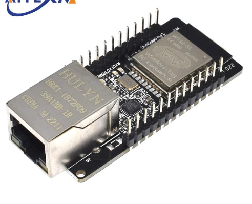

# Stream led animations to an ESP. 

* Control up to 8 x 512 leds @ ~50fps (higher framerate if you use less leds per chan)
* Only supports WS2812 leds (for now)
* Only runs on vanilla ESP32
* Use with <https://github.com/psy0rz/ledder>

## Instructions

## Get and build esp-idf toolkit

**Important: You need version esp-idf toolkit version 4.4. Version 5 will not work!**

This example uses Linux and a regular ESP32, full instructions are here: https://docs.espressif.com/projects/esp-idf/en/latest/esp32/get-started/linux-macos-setup.html#get-started-configure
  
Quick and dirty copypasta:

```
mkdir ~/esp
cd ~/esp
git clone --recursive https://github.com/espressif/esp-idf.git -b v4.4.4
cd esp-idf
./install.sh all
```

## Activate esp-idf toolkit

Every time you want to use it you have to activate it one time:

```
 source ~/esp/esp-idf/export.sh
```

### In Jetbrains Clion

(this section is optional, only if you want to use Clion)

In clion you can go to Build,Exectution,Deployment -> Toolchains and add a toolchain named esp.

Choose to let it load the environment from the file ~/esp/esp-idf/export.sh

Now clion understands and autocompletes all the ESP-idf stuff! 

## Run menuconfig and look at pins that are used.

```
idf.py menuconfig
```

The default config is probably OK for now, just keep in mind which pin is channel 0.

## Connect hardware

The easiest way to start it one of those 8x32 WS2812 matrixes:



Just configure 1 channel and 256 leds in that case.

(Or specify an existing config file by adding  -D SDKCONFIG=sdkconfig.somename)

Once you get the hang of it you can configure up to 8 channels, with each 2 of those displays in series for a total of 16 displays!

Ledder will handle the correct layout and orientation.

If you use that many leds keep this in mind:

 * Use a power supply that can handle the load  (up to 15A per display!)
 * If you use a power supply, connect the power supply to the middle 2 leads. 
 * Or just use USB poewr and set max current via menu config. (USB power can handle at least 1000mA)
 * If you get glitches use a level shifter like the SN74AHCT125N. (dont use the bidirectional onces, those suck) For one simple display you can get away with it, but for multiple displays it gets problematic.
 * Use a esp32 with buildin ethernet like the WT32-ETH01 to handle the bandwidth:



## Create wifi config file:

main/wifi-config.h:
```
#define WIFI_SSID "yourssid"
#define WIFI_PASS "yourpassword"
```

## Build and flash:


The first time you're using an espchip you might need to do this:

```
idf.py partition-table-flash
idf.py bootloader-flash
```

After that you can use this to flash and monitor the program:

```
 idf.py -D SDKCONFIG=sdkconfig.rein1 app-flash monitor
```

Keyboard shortcuts of IDF monitor: <https://github.com/espressif/esp-idf/blob/master/docs/en/api-guides/tools/idf-monitor.rst#keyboard-shortcuts>


Now configure ledder to stream to your display. The number of leds and number of channels should exactly match!

In ledder you will find displayconf-example.js, the examples that use DisplayQOISudp() are used with ledstream.

