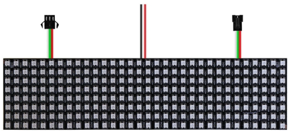
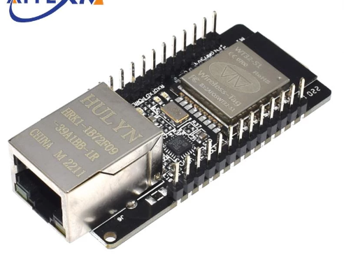

# Stream led animations to an ESP. 

* Steams realtime animations from ledder via http and QOI compression.
* Control up to 8 channels x 512 leds (WS2812) @ ~50fps. (Only on regular esp32, not on s3 yet)
* Control up to 64 x 64 pixel HUB75 display panels @60 fps. (esp32-s3 recommended)
* Use with <https://github.com/psy0rz/ledder>. (wiki: https://github.com/psy0rz/ledder/wiki/Ledstream-via-ESP32 )
* Telnet and console interface for configuration.


# Build instructions

Clone this project:
```
git clone --recursive https://github.com/psy0rz/ledstream
```
To all the commands below, you can add `-D SDKCONFIG=somename` so you can have multiple configs.

In the menuconfig below, go to LEDSTREAM CONFIG and configure your WIFI settings and ledder url. Should be http://ledderserver:3000/stream

(you can also change these settings via CLI or telnet later)

## Build with esp-idf toolkit (linux/MacOS)

**Important: You need version esp-idf toolkit version 4.4. Version 5 will not work!**

This example uses Linux/MacOS and a regular ESP32, full instructions are here: https://docs.espressif.com/projects/esp-idf/en/latest/esp32/get-started/linux-macos-setup.html#get-started-configure
  
Quick and dirty copypasta to get the esp-idf build toolkit:
```
mkdir ~/esp
cd ~/esp
git clone --recursive https://github.com/espressif/esp-idf.git -b v4.4.4
cd esp-idf
./install.sh all
```

### Activate esp-idf toolkit

Every time you want to use it you have to activate it one time:

```
 source ~/esp/esp-idf/export.sh
```

### Configure build and flash

NOTE: Use ./esps3idf instead of idf.py as a shortcut for building for ESP32 S3

```
idf.py -D SDKCONFIG=somename menuconfig
idf.py -D SDKCONFIG=somename build
idf.py -D SDKCONFIG=somename partition-table-flash
idf.py -D SDKCONFIG=somename flash monitor
```

NOTE: only hub75 is currently supported on esp32-s3. if you need ws2812 support, use a regular esp32 for now.

Use ./esps3idf instead of idf.py if you have a esp32-s3

Use ./esps3idf-hdwf2 if you have a Huidu board, see below.


# Connect hardware

## WS2812 leds

Supported hardware: ESP32

The easiest way to start it one of those 8x32 WS2812 matrixes:



Just configure 1 channel and 256 leds in that case.

Once you get the hang of it you can configure up to 8 channels, with each 2 of those displays in series for a total of 16 displays!

You can configure ledder to handle the correct layout and orientation.

## HUB75 led panels

Supported hardware: ESP32, ESP32s3

A nice table for pinouts:


More info at: https://github.com/mrcodetastic/ESP32-HUB75-MatrixPanel-DMA

## HUB75 board Huidu WD-WF2 (Has ESP32-S3 built-in)


Supported by ledstream out of the box:

* Use a USB-C to USB-A cable via an usb hub, or a USB-A to USB-A cable.
* First time force it into download mode by shorting the 2 pads (GPIO0). Otherwise you will see no serial port!
* Use the preconifgured script to build (which correct serial port path):
```
./esps3idf-hdwf2 flash -p /dev/tty.usbmodem01
```
* Remove it from usb and reattach it.
* A new serial port should appear that you can use to to automated flashing from now on.

Thanks to: https://github.com/mrcodetastic/ESP32-HUB75-MatrixPanel-DMA/issues/433


## HUB75 board Huidu WD-WF1 (Has ESP32-S2 built-in)


Supported by ledstream out of the box:

* Use a USB-C to USB-A cable via an usb hub, or a USB-A to USB-A cable.
* First time force it into download mode by shorting the 2 pads (GPIO0). Otherwise you will see no serial port!
* Use the preconifgured script to build (which correct serial port path):
```
./esps2idf-hdwf1 flash -p /dev/tty.usbmodem01
```
* Remove it from usb and reattach it.
* A new serial port should appear that you can use to to automated flashing from now on.
* Since this uses USB CDC mode its a bit fiddly to get into serial console: Usually i have to reattach it a few times while i keep *./esps2idf-hdwf1 monitor -p /dev/tty...* running.

Thanks to: https://github.com/mrcodetastic/HD-WF1-WF2-LED-MatrixPanel-DMA


## Hardware tips

If you use that many leds keep this in mind:

 * Connect a capacitor of 100uF of more directly between GND and 3v3 on the ESP itself,  to prevent bad wifi performance issues.
 * Use a power supply that can handle the load  (up to 15A per display!)
 * If you use a power supply, connect the power supply to the middle 2 leads. 
 * Or just use USB power and set max current via menu config. (USB power can handle at least 1000mA)
 * Use a esp32 with buildin ethernet like the WT32-ETH01 to handle the bandwidth:




# Configure ledder

Follow the wiki at the ledder project for this: 
https://github.com/psy0rz/ledder/wiki/Ledstream-via-ESP32

## Commandline interface

Ledstream now has a commandline interface for basic settings and monitoring.

You can reach it via serial or telnet if you've set a console_pass:

```
ledstream> help
help
  Print the list of registered commands

wifi_ssid  [value]
  wifi SSID (empty = wifi disabled)

wifi_pass  [value]
  wifi password

ledder_url  [value]
  ledder stream url

ota_url  [value]
  firmware upgrade url

console_pass  [value]
  remote console password (empty = remote console disabled)

list
  list all settings

unset  <key>
  revert a setting to its compile-time default

defaults
  revert all settings to compile-time defaults

info
  show firmware/network/system info

reboot
  restart the device

stats
  print wifi + timing_wait_until stats every second (until reboot)
```


# Using Jetbrain Clion (for developers)

Install the esp-idf toolkit like in the previous example.

In clion you can go to Build,Exectution,Deployment -> Toolchains and add a toolchain named esp.

Choose to let it load the environment from the file ~/esp/esp-idf/export.sh

Now clion understands and autocompletes all the ESP-idf stuff! 

